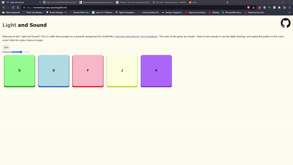
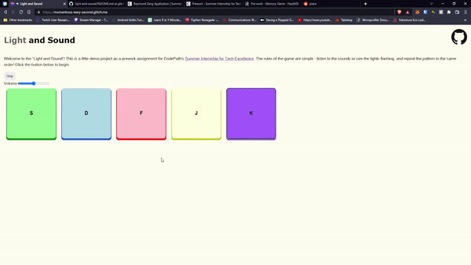
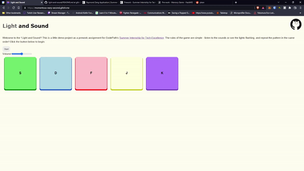
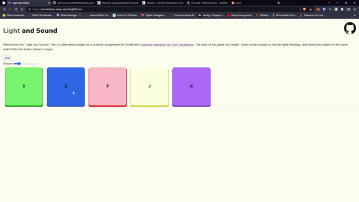
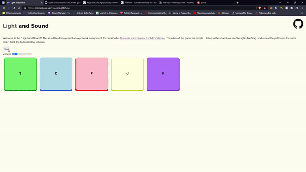

# Pre-work - *Memory Game*

**Memory Game** is a Light & Sound Memory game to apply for CodePath's SITE Program. 

Submitted by: **Raymond Zeng**

Time spent: **4** hours spent in total

Link to project: (https://glitch.com/edit/#!/momentous-wary-second)

## Required Functionality

The following **required** functionality is complete:

* [x] Game interface has a heading (h1 tag), a line of body text (p tag), and four buttons that match the demo app
* [x] "Start" button toggles between "Start" and "Stop" when clicked. 
* [x] Game buttons each light up and play a sound when clicked. 
* [x] Computer plays back sequence of clues including sound and visual cue for each button
* [x] Play progresses to the next turn (the user gets the next step in the pattern) after a correct guess. 
* [x] User wins the game after guessing a complete pattern
* [x] User loses the game after an incorrect guess

The following **optional** features are implemented:

* [x] Any HTML page elements (including game buttons) has been styled differently than in the tutorial
* [ ] Buttons use a pitch (frequency) other than the ones in the tutorial
* [x] More than 4 functional game buttons
* [x] Playback speeds up on each turn
* [x] Computer picks a different pattern each time the game is played
* [ ] Player only loses after 3 mistakes (instead of on the first mistake)
* [x] Game button appearance change goes beyond color (e.g. add an image)
* [ ] Game button sound is more complex than a single tone (e.g. an audio file, a chord, a sequence of multiple tones)
* [ ] User has a limited amount of time to enter their guess on each turn

The following **additional** features are implemented:

- [x] Easter eggs for certain tones played while not in a game
- [x] Direct linking to GitHub repository from website
- [x] A volume slider for adjusting how loud the tones are
- [x] Keyboard suppport for guessing buttons

## Video Walkthrough (GIF)

## Additional Feature Walkthroughs

### GitHub link and Working Volume Slider

### Easter Eggs (the "Sound" header plays a secret tone!)

### Dark/Light Mode Toggle

# Questions and Reflections

**1. If you used any outside resources to help complete your submission (websites, books, people, etc) list them here.**

Beyond the CodePath prework guide, I used the Mozilla Developer Network (MDN) documentation extensively as a general manual for HTML/CSS/JS material, [HTMLColorCodes](https://htmlcolorcodes.com/) to select button hover color and the [Wikipedia Page for Piano Frequencies](https://en.wikipedia.org/wiki/Piano_key_frequencies) for the 5th button (C5).

Mario Idle Sprite from [PNGWing](https://www.google.com/url?sa=i&url=https%3A%2F%2Fwww.pngwing.com%2Fen%2Ffree-png-yserw&psig=AOvVaw3-FEb26vkKoK-fn9Uv2AzB&ust=1648751744033000&source=images&cd=vfe&ved=0CAwQjhxqFwoTCMjfuoK97vYCFQAAAAAdAAAAABAu)

Mario Jump Sprite from [PNGEgg](https://www.google.com/url?sa=i&url=https%3A%2F%2Fwww.pngegg.com%2Fen%2Fpng-nlqtr&psig=AOvVaw3-FEb26vkKoK-fn9Uv2AzB&ust=1648751744033000&source=images&cd=vfe&ved=0CAsQjRxqFwoTCMjfuoK97vYCFQAAAAAdAAAAABA3)

GitHub Logo from [GitHub's Logo and Usage page](https://github.com/logos)

Twilight Sparkle GIF from unknown author (background pony #06FB is a generic name), found on Derpibooru @ [https://derpibooru.org/images/1707133](https://derpibooru.org/images/1707133)

**2. What was a challenge you encountered in creating this submission (be specific)? How did you overcome it?**

One challenge that I encountered during the creation of this submission had to deal with (re)learning the CSS to make the website more visually appealing.
As someone who usually invests a majority of a project's development time to functionality, some of my consumer-facing skills are underutilized. I used the CodePath guide as a baseline, then checked out a few resources online (namely the Mozilla Developer Network documentation, which is excellent) to find my way around CSS again. While the end result isn't going to top any design charts, it is a step up from my usual weekend projects, and I'm proud of the little things that I've added such as the buttons physically "pressing down" as well as the expanding GitHub picture. I am also particularly fond of figuring out the proper CSS tags and JS functionality to have the title words do something.

**3. What questions about web development do you have after completing your submission?**

As a web developer, what are the expectations for time spent on backend versus frontend? I understand that certain roles specialize on a certain part, but what about fullstack developers?
Would I be spending a majority of my time designing the website, working on HTML/CSS structuring, or the JS that powers the operation?
I understand that unit testing and making sure that a product is working is also a critical part of software development. What tools exist out there that could help me test my website?

**4. If you had a few more hours to work on this project, what would you spend them doing (for example: refactoring certain functions, adding additional features, etc). Be specific.**

If I had more time to work on the project, I would continue to work on improving the front end to make the website even more visually appealing, and adding more easter eggs. I would also consider adding in the rest of the remaining optional functionalities highlighted in the CodePath prework section.

In addition to the above, I would change the win/loss system to be not based on alerts, and rather visual cues on the website itself. I personally find that the alerts are a *bit* disruptive to the gameplay experience, and would prefer to see a sign on the website rather than the browser. I would also consider adding a backend component, and perhaps some way of making the game include multiple players (perhaps a daily pattern rather than generated each time, similar to Wordle?).

## Interview Recording URL Link

[My 5-minute Interview Recording](https://youtu.be/DQtRNQKGWgY)

## License

    Copyright Raymond Zeng

    Licensed under the Apache License, Version 2.0 (the "License");
    you may not use this file except in compliance with the License.
    You may obtain a copy of the License at

        http://www.apache.org/licenses/LICENSE-2.0

    Unless required by applicable law or agreed to in writing, software
    distributed under the License is distributed on an "AS IS" BASIS,
    WITHOUT WARRANTIES OR CONDITIONS OF ANY KIND, either express or implied.
    See the License for the specific language governing permissions and
    limitations under the License.
